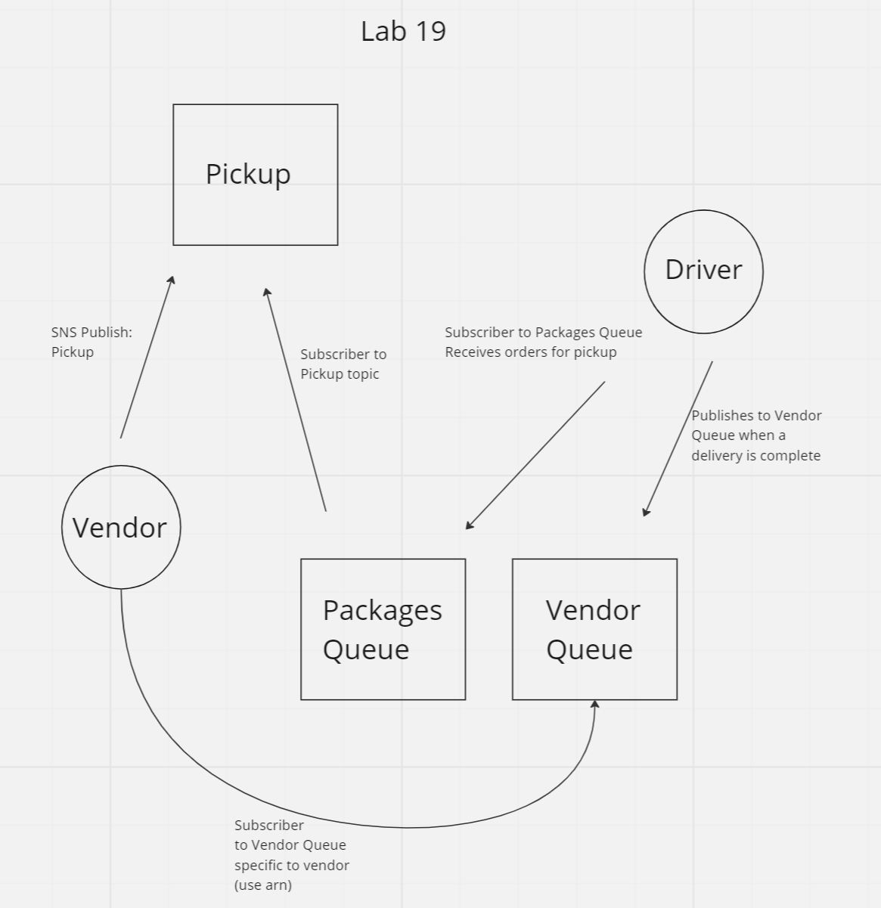
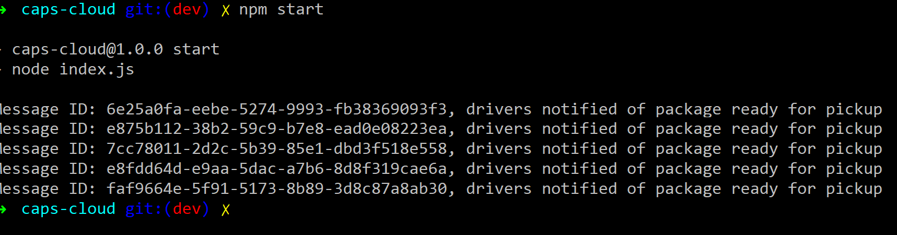
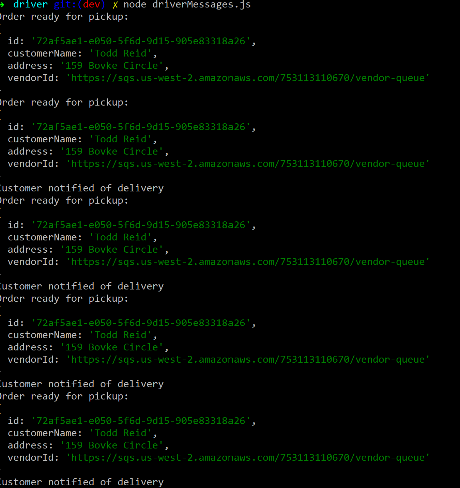
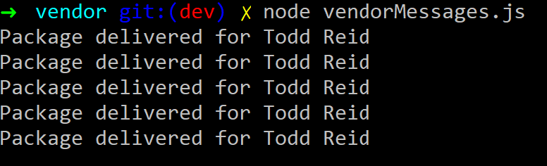

# caps-cloud

## Overview
This project mimicked and earlier project that set up a publisher and subscriber system between a driver and vendor. The previous project used Socket.io and a message queue in the server to provide notifications to drivers of orders ready for pickup and notifications to vendors for orders that were delivered. This project does the same thing, but uses AWS topics instead of Socket.io events and AWS SQS instead of a queue implemented in the server.

## Architecture


## How to Use
 - NOTE: You would have to configure your own AWS topics and queues to get this to work locally, but here's how it should work

 - Start the application with the command ```npm start```. This starts an interval that will publish to the topic that a order is read for pickup. The interval is currently set up to run five times.

 

 - After the the notifications have started, start the driver's message queue by going into the driver directory and use the command ```node driverMessges.js```. It will get the message notification. The driver will stop listening while he delivers the package (timeout set for 10 seconds). After the package is delivered, the driver will publish a message to the vendors queue that the package has been delivered and the driver will start listening to messages again. The next message in the queue will start this all over again.

 

 - After the driver finishes delivering packages, go into the vendor directory and use the command ```vendorMessages```. The vendors delivered notifications will log to the console.

 